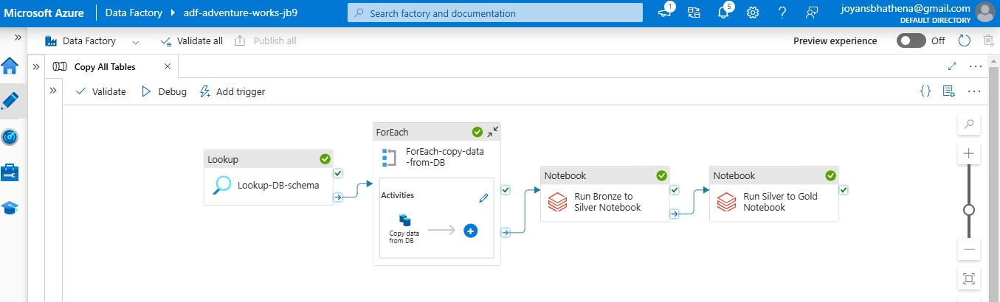

# Personal Data Engineering Project

This repository documents my personal data engineering project, where I created an automated, end-to-end data pipeline using Azure Data Factory (ADF) and Databricks, following the Medallion Architecture to organize data strategically within a data lake.

---

## Project Overview
The project consists of the following stages:

1. **Source to Bronze Layer**
   - Connected a local SQL Server database to Azure Data Factory.
   - Used ADF activities to load data into the Bronze layer in the data lake.

2. **Bronze to Silver Transformation**
   - Performed basic data cleaning and transformation.
   - Converted the data into Delta format for better storage and performance.

3. **Silver to Gold Transformation**
   - Enhanced data for analytics by renaming columns, ensuring correct data types, and optimizing formats.

4. **Automated End-to-End Pipeline**
   - Linked the transformations into a single, automated pipeline in Azure Data Factory.

---

## Technologies and Tools Used

### Azure Data Factory (ADF)
- **Activities Used:**
  - **Lookup:** Retrieved schema information of all tables in the SQL database to streamline the copying process.
  - **ForEach:** Iterated over tables to copy data from the SQL Server database into the Bronze layer.

### Databricks Notebooks
- **Bronze to Silver Notebook:**
  - Basic data transformation and cleaning.
  - Stored transformed data in Delta format.
- **Silver to Gold Notebook:**
  - Made data analysis-ready by renaming columns, ensuring accurate data types, and further cleaning.

### Azure Key Vault
- Managed sensitive information (e.g., connection strings) securely using Azure Key Vault.

### Azure Resource Groups
- Grouped resources logically within Azure to maintain best practices for scalability and organization.

---

## Medallion Architecture
This project adheres to the Medallion Architecture, which organizes data into distinct layers for improved data management and analysis:

1. **Bronze Layer:** Raw data copied from the SQL Server database.
2. **Silver Layer:** Cleaned and transformed data in Delta format.
3. **Gold Layer:** Analytics-ready data optimized for querying.

---

## Key Features
- **End-to-End Automation:** The pipeline integrates ADF and Databricks for a seamless, fully automated data processing workflow.
- **Industry Best Practices:**
  - Used Azure Key Vault for secure handling of sensitive data.
  - Organized resources into an Azure Resource Group.
- **Scalability and Efficiency:**
  - Followed Medallion Architecture for modular and scalable data pipelines.
  - Utilized Delta format for optimized storage and querying.

---

## Pipeline Workflow
1. **Lookup Activity:**
   - Retrieves schema information of all tables in the SQL database.
2. **ForEach Activity:**
   - Loops over all tables to copy data to the Bronze layer.
3. **Bronze to Silver Transformation:**
   - Runs a Databricks notebook to clean data and store it in Delta format.
4. **Silver to Gold Transformation:**
   - Runs another Databricks notebook to prepare analytics-friendly data.
5. **Automated Pipeline:**
   - Combines all steps into a single ADF pipeline.

---

## Lessons Learned
- Leveraging **Azure Key Vault** ensures secure handling of credentials.
- Following the **Medallion Architecture** simplifies data organization and enhances scalability.
- Automating data pipelines reduces manual effort and increases efficiency.

---

## Future Work
- Integrate additional data sources to enrich the pipeline.
- Implement advanced transformations using PySpark.
- Add monitoring and alerting for pipeline performance.

---

## Author
**Joyan Bhathena**  
Master's in Computer Science (IU Berlin)  
[LinkedIn](https://www.linkedin.com/in/joyan-bhathena/)

